<!-- Banner -->

<!-- Apresentação -->

## Presentation

A curious front-end programmer, who seeks more and more knowledge every day, aiming to become a full-stack developer in the future. Lover of TypeScript, Clean Code, and everything that makes a programmer's eyes shine. 
<!-- [See my full presentation! ☕]() -->

> Being the richest man in the cemetery doesn't interest me.  
> Going to bed at night saying I did something wonderful is what matters to me.  
> ~ **Steve Jobs**

<!-- Tecnologias -->

## Technologies

#### Languages / Libs / FrameWorks

 
 

 

#### Others Langs

 
 

#### Tools

 

<!-- Estatisticas -->

## Statistics

